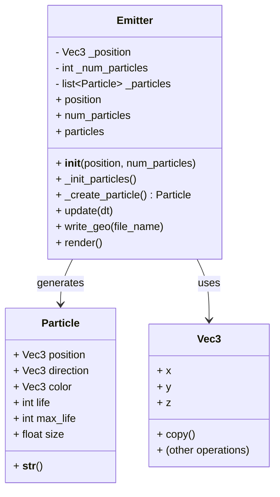
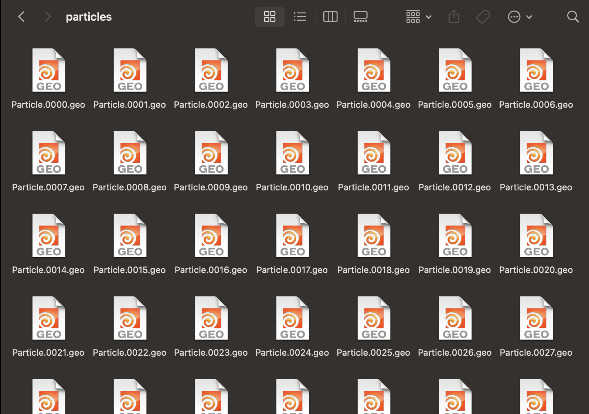

# Particle System — GEO Sequence Exporter

This project implements a simple particle emitter simulation in Python.

The system simulates thousands of particles affected by gravity, color variation, directional emission, and lifetime-based respawning.
Each animation frame is exported to a .geo file compatible with Houdini’s PGEOMETRY format.

---

---

This project will export the `.geo` files into the `OUTPUT_DIR` as shown in the image.

